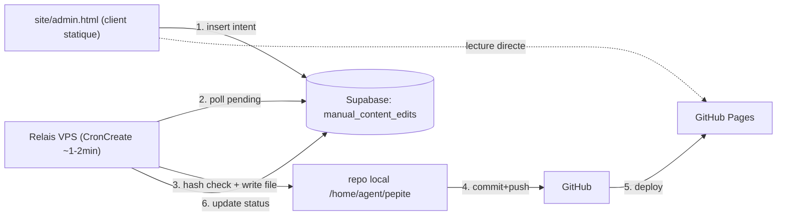
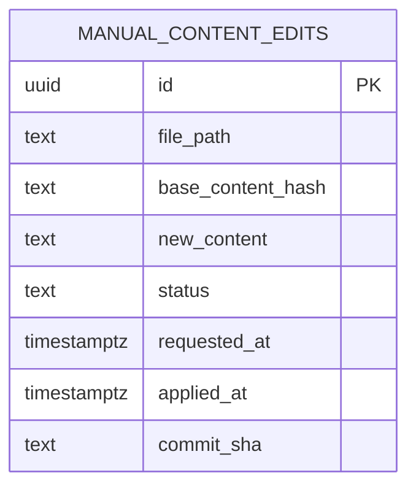

# Architecture Spine — Back-office CMS pour Cadeau Malin

## Design Paradigm

**File d'attente relayée par un agent existant.** Le back-office (client statique, aucun serveur propre) n'a jamais d'accès direct à `git`. Toute intention de publication est une ligne insérée dans une table Supabase ; un relais côté VPS — qui réutilise l'infrastructure de publication déjà existante de Pépite — la lit et l'exécute. Ce paradigme a une seule raison d'être : le site est 100% statique (GitHub Pages), sans serveur applicatif exposé, et il existe déjà un agent avec accès `git`+SSH — le paradigme exploite cette réalité plutôt que d'en créer une nouvelle.



## Invariants & Rules

### AD-1 — Paradigme : file d'attente Supabase relayée
- **Binds:** FR-5, FR-6, all
- **Prevents:** deux chemins de publication indépendants (back-office et Pépite) qui divergeraient en conventions de commit, gestion d'erreur, ou sécurité.
- **Rule:** le back-office n'écrit **jamais** directement dans `git` ni n'appelle l'API GitHub. Toute publication passe par une insertion dans la table `manual_content_edits` (statut `pending`). Un relais unique l'applique.

### AD-2 — Frontière stricte du client
- **Binds:** FR-2, FR-4, FR-5
- **Prevents:** un deuxième chemin de lecture/écriture qui contournerait AD-1.
- **Rule:** le back-office ne parle qu'à (a) Supabase (Auth + table `manual_content_edits`) en écriture, et (b) aux pages publiques déjà déployées, en lecture seule (fetch direct de l'URL publiée pour afficher le contenu actuel — pas besoin d'auth pour lire du contenu déjà public).

### AD-3 — Propriétaire unique de l'écriture fichier + git
- **Binds:** FR-5, FR-7
- **Prevents:** deux conventions de commit/push incompatibles (une pour Pépite, une pour le back-office).
- **Rule:** le relais **doit** réutiliser `scripts/github_commit_changes.js` + `scripts/github_open_pr_or_push.js` tels quels (aucune logique git dupliquée). Le message de commit du relais est préfixé distinctement (ex. `chore(back-office):`) pour rester traçable et distinct des commits Pépite. `status = 'applied'` n'est écrit qu'**après** le push réussi (pas après le seul commit local) — c'est la définition de "publié" retenue par FR-5.

### AD-4 — Détection de conflit par hash
- **Binds:** FR-6
- **Prevents:** écrasement silencieux d'une modification faite par Pépite (cycle heartbeat) entre le chargement de l'éditeur et la publication.
- **Rule:** `manual_content_edits.base_content_hash` (sha256 du contenu au moment du chargement) est comparé par le relais au hash réel du fichier dans le repo avant toute écriture. Mismatch → `status = 'conflict'`, aucune écriture, aucun commit ; l'utilisateur est notifié au prochain chargement du back-office.

### AD-5 — Cadence du relais découplée du heartbeat marketing
- **Binds:** FR-5, all
- **Prevents:** confondre la boucle de création de contenu stratégique (Pépite, ~3h, CronCreate existant) avec la boucle de réactivité du back-office (SM-1 du PRD : < 5 min bout-en-bout) — les deux ont des exigences de cadence incompatibles si fusionnées.
- **Rule:** un second job `CronCreate`, dédié, cadence courte (1-2 minutes), ne fait qu'une chose : vérifier `manual_content_edits` pour des lignes `pending` et les appliquer. Il ne fait aucune création de contenu stratégique — c'est strictement un exécuteur de la file d'attente.

### AD-6 — Auth/RLS identique au dashboard
- **Binds:** FR-1, all
- **Prevents:** une nouvelle surface d'authentification, ou une policy RLS `anon` qui reproduirait un blocage déjà rencontré sur ce projet (tentative bloquée par le classificateur de sécurité sur une policy `anon` insert-only pour la table `leads`).
- **Rule:** authentification = Supabase Auth Google Sign-In, exactement le pattern de `site/dashboard.html`. RLS sur `manual_content_edits` : `insert` et `select` restreints au rôle `authenticated` **et** `auth.jwt() ->> 'email' = '<email propriétaire>'` — jamais de policy `anon`.

## Consistency Conventions

| Concern | Convention |
| --- | --- |
| Naming (table, colonnes) | `manual_content_edits` (snake_case, cohérent avec les 7 tables Supabase existantes : `agent_logs`, `growth_experiments`, etc.) |
| `file_path` (format) | Toujours relatif à la racine du repo (ex. `site/blog/mon-article.html`), jamais relatif à `site/` seul ni absolu — c'est le format déjà attendu par `assertInsideRepo()` dans `scripts/github_commit_changes.js`. Les deux côtés (back-office et relais) doivent produire/consommer ce même format. |
| Hash (AD-4) | `sha256` du contenu texte brut du fichier (encodage UTF-8), calculé côté client au chargement et recalculé identiquement côté relais — même algorithme des deux côtés, non négociable. |
| Auth | Identique à `dashboard.html` — Supabase Auth Google OAuth, email propriétaire exact, jamais `anon` sur les tables sensibles |
| Journalisation | Chaque publication back-office insère aussi une ligne dans `agent_logs` avec `agent = 'back-office-manuel'` (distinct de `content-agent`, `marketing-ops-agent`, etc.) pour que l'audit heartbeat de Pépite la voie (FR-7) |
| Commit messages | Préfixe `chore(back-office):` pour toute publication issue du relais, jamais confondu avec un commit Pépite |
| Secrets | Aucun nouveau secret — le relais réutilise la clé SSH de déploiement déjà en place sur le VPS |

## Stack

Aucune nouvelle dépendance. Réutilisation intégrale de l'existant :

| Name | Version | Usage |
| --- | --- | --- |
| `@supabase/supabase-js` | ^2.45.4 (déjà dans `package.json`) | Client back-office (auth + insert) et relais (poll + update status) |
| Node.js (scripts CLI) | déjà en place | Relais (nouveau script, réutilise `scripts/github_commit_changes.js` + `scripts/github_open_pr_or_push.js`) |
| `CronCreate` (Claude Code) | déjà en place (heartbeat existant) | Nouveau job dédié, cadence 1-2 min, scope différent du heartbeat marketing |

## Structural Seed

```text
site/
  admin.html                     # back-office (auth Google + liste + editeur + apercu + bouton Publier)

scripts/
  apply_pending_content_edits.js # NOUVEAU — relais : poll manual_content_edits, hash check (AD-4),
                                  #   reutilise github_commit_changes.js + github_open_pr_or_push.js (AD-3)
  relay-content-edits.sh         # NOUVEAU — wrapper invoque par le job CronCreate dedie (AD-5)
```

### Entité (ERD minimal)



`status` ∈ `{pending, applied, conflict}` (AD-4). Une ligne par intention de publication — pas d'historique de versions au-delà (out of scope PRD §6.2).

## Capability → Architecture Map

| Capability / Area | Lives in | Governed by |
| --- | --- | --- |
| FR-1 (auth) | `site/admin.html` | AD-6 |
| FR-2, FR-3 (liste/filtre) | `site/admin.html` (fetch direct des pages publiées) | AD-2 |
| FR-4 (édition + aperçu) | `site/admin.html` | AD-2 |
| FR-5 (publication) | `site/admin.html` → `manual_content_edits` → `scripts/apply_pending_content_edits.js` | AD-1, AD-3, AD-5 |
| FR-6 (conflit) | `scripts/apply_pending_content_edits.js` | AD-4 |
| FR-7 (journalisation) | `scripts/apply_pending_content_edits.js` → `agent_logs` | Convention "Journalisation" |

## Deferred

- **Édition par champs structurés** (au lieu de texte brut) — différé par le PRD lui-même (§6.2), pas une décision d'architecture à trancher maintenant.
- **Latence du relais si SM-1 (<5min) n'est pas tenu en pratique** — si la cadence 1-2 min du job dédié (AD-5) s'avère encore trop lente à l'usage réel, une option de publication immédiate (Edge Function avec clé de déploiement) reste ouverte — non retenue maintenant faute de besoin observé (voir addendum PRD, option b rejetée pour v1).
- **Suppression de fichiers / création de nouvelles fiches depuis le back-office** — hors scope PRD v1 (§5, §6.2), donc hors scope de cette architecture.
- **Gestion de plusieurs éditions concurrentes sur des fichiers différents** — le modèle actuel (une ligne = un fichier) suffit pour un usage mono-utilisateur ; pas de verrouillage distribué nécessaire à ce stade.
